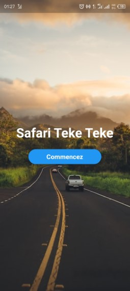

# Backend pour une application pour étudiant
# ----------------------------------------------
## Le nom de l'application safari teke teke, 

cette application est composée de deux parties: 
    - Le backend ou le server 
    - Le frontend ou le client

Le backend sert d'api simple pour une application développée en flutter

Ce back a comme caractéristique :
  - Donne la possibilté de se créer un compte comm
      - client
      - chauffeur
      - Admin (uniquement par le superUser
  - Donne la possibilité de se connecter
      Le back détermine le rôle en fonction de l'enregistrement dans la bdd.
      Le front affiche les différentes fenêtre selon le rôle.
  
  - Si vous êtes chauffeur, vous pouvez :
    - créer une nouvelle publication
    - Supprimer votre propre publication
    - Editer votre propre publication

  - Si vous êtes client:
    - Vous ne pouvez voir que les publications que vous recherchez en spécifiant : 
        - Le lieu de destination. 
        - Le lieu de départ . 
    - Vous pouvez chatter en socket avec le propriétaire de la publication
  
